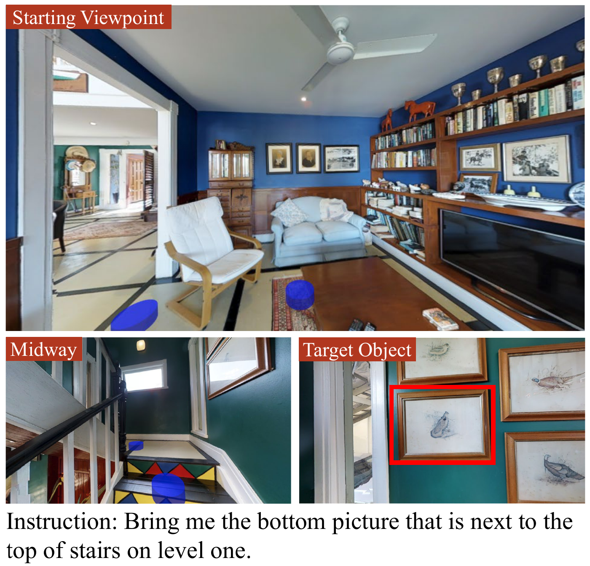

# REVERIE: Remote Embodied Visual Referring Expression in Real Indoor Environments

<h3><b>News</b>: The REVERIE Challenge on ACL Workshop 2020 is open! More details see <a href="https://alvr-workshop.github.io/">here</a>.</h3>

Here are the pre-released code and data for the CVPR 2020 paper [REVERIE: Remote Embodied Visual Referring Expression in Real Indoor Environments](https://arxiv.org/abs/1904.10151)

<table width="100%" border=1 frame=void rules=cols>
  <tr><td style="border-left-style:none; border-right-style:none;">
    <b>Table of Contents</b><br><br>
    <a href="#1">1. Definition of the REVERIE Task</a><br>
    <a href="#2">2. Install without Docker</a><br>
<a href="#3">3. Install with Docker</a><br>
<a href="#4">4. Train and Test the Model</a><br>
<a href="#5">5. Data Organization of the REVERIE Task</a><br>
<a href="#6">6. Integrate into Your Existing Project</a><br>
<a href="#7">7. Result File Format</a><br>
<a href="#8">8. Acknowledgements</a><br>
<a href="#9">9. Reference</a><br>
  <td style="border-left-style:none; border-right-style:none;">
  <div align="center">

</div>
  </td></tr>
</table>

## <a name="1"></a>1. Definition of the REVERIE Task
As shown in the above figure, a robot agent is given a natural language instruction referring to a remote object (here in the red bounding box) in a photo-realistic 3D environment. The agent must navigate to an appropriate location and identify the object from multiple distracting candidates. The blue discs indicate nearby navigable viewpoints provided the simulator.

## <a name="2"></a>2. Install without Docker

**Note\*** This section prepares everything to run or train our Navigator-Pointer model. If you are familar with R2R and just want to do the REVERIE task, you can directly go to <a href="#6">Section 6</a>.

**Note\*\*** If you have a fresh Ubuntu system, the following instruction should work well. If not, it may screw up your existing project environments but you can still have a try. At last, you can try <a href="#3">Section 3. Install with Docker</a>.

### Prerequisites

A C++ compiler with C++11 support is required. Matterport3D Simulator has several dependencies:
- [Ubuntu](https://www.ubuntu.com/) 14.04, 16.04, 18.04
- [OpenCV](http://opencv.org/) >= 2.4 including 3.x 
- [OpenGL](https://www.opengl.org/)
- [OSMesa](https://www.mesa3d.org/osmesa.html)
- [GLM](https://glm.g-truc.net/0.9.8/index.html)
- [Numpy](http://www.numpy.org/)
- [pybind11](https://github.com/pybind/pybind11) for Python bindings
- [Doxygen](http://www.doxygen.org) for building documentation

E.g. installing dependencies on Ubuntu:
```
sudo apt-get install libopencv-dev python-opencv freeglut3 freeglut3-dev libglm-dev libjsoncpp-dev doxygen libosmesa6-dev libosmesa6 libglew-dev
```
If still lack some packages during runing cmake/make or our codes, you can refer to the content in the [Dockerfile](https://github.com/YuankaiQi/REVERIE/blob/master/Dockerfile).

### 2.1. Clone Repo
Clone the REVERIE repository:
```
git clone https://github.com/YuankaiQi/REVERIE.git
cd REVERIE
```

Note that our repository is based on the v0.1 version [Matterport3DSimulator](https://github.com/peteanderson80/Matterport3DSimulator), which was originally proposed with the Room-to-Room dataset. 

### 2.2. MAttNet3 Download
Download our pre-trained mini MAttnet3 from <a href="https://drive.google.com/uc?id=1kxyH8kWHiskbv7bRzYzC9rM1lX51K004&export=download" target="_blank">Google Drive</a> or <a href="https://pan.baidu.com/s/1Y5KoAV4FyrFz-KzMBsZmBw" target="_blank">Baidu Yun (code: ophy)</a>, which is modified from <a href="https://github.com/lichengunc/MAttNet" target="_blank">MAttNet</a> to support our model training. Unzip it into the MAttnet3 folder. This is used as the our Pointer model.

### 2.3. Dataset Download
You need to download RGB images and house segmentation files of the [Matterport3D dataset](https://niessner.github.io/Matterport/). The following data types are required:
- `matterport_skybox_images`
- `house_segmentations`

The [metadata](https://github.com/niessner/Matterport) is also needed, and put it under the root of your dataset, e.g. Matterport/metadata.

Then update the 'matterportDir' setting in trainFast.py.

### 2.4. Pre-computed Image Features Download
Download and extract the tsv files into the `img_features` directory from [Matterport3DSimulator](https://github.com/peteanderson80/Matterport3DSimulator). You will only need the ImageNet features to replicate our results. 
- [ResNet-152-imagenet features [380K/2.9GB]](https://www.dropbox.com/s/o57kxh2mn5rkx4o/ResNet-152-imagenet.zip?dl=1)

### 2.5. Installation with PyTorch
Let us get things ready to run experiments.

#### 2.5.1. Create Anaconda Environment
```bash
# change "rog" (remote object grounding) to any name you prefer
conda create -n rog python=3.6
```
Activate the enviorment you just created
```
conda activate rog
```
#### 2.5.2. Install Special Requirements
```
pip install -r tasks/REVERIE/requirements.txt
```

#### 2.5.3. Install PyTorch
```
# with CUDA 92
conda install pytorch=0.4.0 cuda92 -c pytorch
conda install torchvision=0.2.0 -c pytorch
```
If you use a newer version, you need to modify codes to load pretrained models.

### 2.6. Compile the Matterport3D Simulator
Let us compile the simulator so that we can call its functions in python.

Build EGL version using CMake:
```bash
cd build
cmake -DEGL_RENDERING=ON ..

# Double-check if CMake find the proper path to your python
# if not, remove the make files and use the cmake with option below instead
rm -rf *
cmake -DEGL_RENDERING=ON -DPYTHON_EXECUTABLE:FILEPATH=/path/to/your/bin/python ..

make
cd ../
```

**Note** There are three rendering options, which are selected using [cmake](https://cmake.org/) options during the build process:

- Off-screen GPU rendering using [EGL](https://www.khronos.org/egl/): `cmake -DEGL_RENDERING=ON ..`
- Off-screen CPU rendering using [OSMesa](https://www.mesa3d.org/osmesa.html): `cmake -DOSMESA_RENDERING=ON ..`
- GPU rendering using OpenGL (requires an X server): `cmake ..`

The recommended (fast) approach for training agents is using off-screen GPU rendering (EGL).

### 2.7. Compile MAttNet3
#### 2.7.1. Compile pytorch-faster-rcnn
```
cd MAttNet3/pyutils/mask-faster-rcnn/lib
```
You may need to change the `-arch` version in `Makefile` to compile the cuda code:

  | GPU model  | Architecture |
  | ------------- | ------------- |
  | TitanX (Maxwell/Pascal) | sm_52 |
  | GTX 960M | sm_50 |
  | GTX 1080 (Ti) | sm_61 |
  | Grid K520 (AWS g2.2xlarge) | sm_30 |
  | Tesla K80 (AWS p2.xlarge) | sm_37 |

Compile the CUDA-based `nms` and `roi_pooling` using following simple commands:
```
make
```

#### 2.7.2. Compile refer
```
cd ../../refer
make
```
It will generate ``_mask.c`` and ``_mask.so`` in ``external/`` folder.

## <a name="3"></a>3. Install with Docker (not tested)

### Prerequisites

- Nvidia GPU with driver >= 396.37
- Install [docker](https://docs.docker.com/engine/installation/)
- Install [nvidia-docker2.0](https://github.com/nvidia/nvidia-docker/wiki/Installation-(version-2.0))
- Note: CUDA / CuDNN toolkits do not need to be installed (these are provided by the docker image)

### 3.1 Clone Repo

Clone the REVERIE repository:
```
git clone https://github.com/YuankaiQi/REVERIE.git
cd REVERIE
```

### 3.2. Dataset Download

First download fiels as [Section 2.3](#23-Dataset-Download). Then set an environment variable to the location of the dataset, where <PATH> is the full absolute path (not a relative path or symlink) to the directory containing the individual matterport scan directories (17DRP5sb8fy, 2t7WUuJeko7, etc):
```
export MATTERPORT_DATA_DIR=<PATH>
```

Note that if <PATH> is a remote sshfs mount, you will need to mount it with the `-o allow_root` option or the docker container won't be able to access this directory. 

### 3.3. Dataset Preprocess

To make data loading faster and to reduce memory usage we preprocess the `matterport_skybox_images` by downscaling and combining all cube faces into a single image using the following script:
```
./scripts/downsize_skybox.py
```

This will take a while depending on the number of processes used. By default images are downscaled by 50% and 20 processes are used.

### 3.4. Build Simulator

Build the docker image:
```
docker build -t reverie .
```

Run the docker container, mounting both the git repo and the dataset:
```
nvidia-docker run -it --mount type=bind,source=$MATTERPORT_DATA_DIR,target=/root/mount/Matterport3DSimulator/data/v1/scans,readonly --volume `pwd`:/root/mount/Matterport3DSimulator reverie
```

Now (from inside the docker container), build the simulator and run the unit tests:
```
cd /root/mount/Matterport3DSimulator
mkdir build && cd build
cmake -DEGL_RENDERING=ON ..
make
cd ../
```

**Note** There are three rendering options, which are selected using [cmake](https://cmake.org/) options during the build process (by varying line 3 in the build commands immediately above):
- Off-screen GPU rendering using [EGL](https://www.khronos.org/egl/): `cmake -DEGL_RENDERING=ON ..`
- Off-screen CPU rendering using [OSMesa](https://www.mesa3d.org/osmesa.html): `cmake -DOSMESA_RENDERING=ON ..`
- GPU rendering using OpenGL (requires an X server): `cmake ..` 

The recommended (fast) approach for training agents is using off-screen GPU rendering (EGL).

### 3.5. Compile MAttNet3
#### 3.5.1. Compile pytorch-faster-rcnn
```
cd MAttNet3/pyutils/mask-faster-rcnn/lib
```
You may need to change the `-arch` version in `Makefile` to compile the cuda code:

  | GPU model  | Architecture |
  | ------------- | ------------- |
  | TitanX (Maxwell/Pascal) | sm_52 |
  | GTX 960M | sm_50 |
  | GTX 1080 (Ti) | sm_61 |
  | Grid K520 (AWS g2.2xlarge) | sm_30 |
  | Tesla K80 (AWS p2.xlarge) | sm_37 |

Compile the CUDA-based `nms` and `roi_pooling` using following simple commands:
```
make
```

#### 3.5.2. Compile refer
```
cd ../../refer
make
```
It will generate ``_mask.c`` and ``_mask.so`` in ``external/`` folder.

### 3.6. Enter Simulator with X server
Run the docker container while sharing the host's X server and DISPLAY environment variable with the container:
```
xhost +
nvidia-docker run -it -e DISPLAY -v /tmp/.X11-unix:/tmp/.X11-unix --mount type=bind,source=$MATTERPORT_DATA_DIR,target=/root/mount/Matterport3DSimulator/data/v1/scans,readonly --volume `pwd`:/root/mount/Matterport3DSimulator reverie
cd /root/mount/Matterport3DSimulator
```

If you get an error like `Error: BadShmSeg (invalid shared segment parameter) 128` you may also need to include `-e="QT_X11_NO_MITSHM=1"` in the docker run command above.


## <a name="4"></a>4. Train and Test the Model
+ **For training**
You can download our pre-trained models from [Google Drive](https://drive.google.com/uc?id=16Kj1L3m7QWSffzygnuue084Q9b7IOhsQ&export=download) or [Baidu Yun](). If you want to train by yourself, just run the following command:
```
python tasks/REVERIE/trainFast.py --feedback_method sample2step --experiment_name releaseCheck
```
or (if using docker)
```
python3 tasks/REVERIE/trainFast.py --feedback_method sample2step --experiment_name releaseCheck  
```


+ **For testing**
To test the model, you need first obtain navigation results by 
```
python tasks/REVERIE/run_search.py
```
or (if using docker)
```
python3 tasks/REVERIE/run_search.py  
```
Then run the following command to obtain the grounded object
```
python tasks/REVERIE/groundingAfterNav.py
```
or (if using docker)
```
python3 tasks/REVERIE/groundingAfterNav.py 
```
Now, you should get results in the 'experiment/releaseCheck/results/' folder.

Note that the results might be slightly different due to using different dependant package versions or GPUs. 

## <a name="5"></a>5. Data Organization of the REVERIE Task
In the tasks/REVERIE/data folder, you will have REVERIE_train.json, REVERIE_val_seen.json, REVERIE_val_unseen.json, and REVERIE_test four files, which provide instructions, paths, and target object of each task (except the REVERIE_test file). In the tasks/REVERIE/data/BBox folder, you will have json files that record objects observed at each viewpoint within 3 meters.

+ **Example of tarin/val_seen/val_unseen.json file**
```
[
  {
    "distance" : 11.65, # distance to the goal viewpoint
    "ix": 208,  # reserved data, not used
    "scan": "qoiz87JEwZ2", # building ID
    "heading": 4.59, # initial parameters for agent
    "path_id": 1357, # inherited from the R2R dataset
    "objId": 66, # the unique object ID in the current building 
    "id": "1357_66" # task id
    "instructions":[ # collected instructions for REVERIE
        "Go to the entryway and clean the coffee table", 
        "Go to the foyer and wipe down the coffee table", 
        "Go to the foyer on level 1 and pull out the coffee table further from the chair"
     ]
    "path": [ # inherited from the R2R dataset
        "bdb1023cb7cc4ebd8245b9291fcbc1a2", 
        "a6ba3f53b7964464b23341896d3c75fa", 
        "c407e34577aa4724b7e5d447a5d859d1", 
        "9f68b19f50d14f5d8371447f73c3a2e3", 
        "150763c717894adc8ccbbbe640fa67ef", 
        "59b190857cfe47f691bf0d866f1e5aeb", 
        "267a7e2459054db7952fc1e3e45e98fa"
      ]
     "instructions_l":[ # inherited from the R2R dataset and provided just for convenience 
        "Walk into the dining room and continue past the table. Turn left when you xxx ", 
       ...
       ]
  },
  ...
]
```
+ **Example of json file in the bbox folder**

    File name format: ScanID_ViewpointID.json, e.g.,VzqfbhrpDEA_57fba128d2f042f7a59793c665a3f587.json
```
{ # note that this is in the variable type of dict not list
  "57fba128d2f042f7a59793c665a3f587":{ # this key is the id of viewpoint
    "827":{ # the key if object ID
      "name": "toilet",
      "visible_pos":[
        6,7,8,9,19,20  # view index (0~35) which contain the object. Index is consitent with that in R2R 
        ],
      "bbox2d":[
        [585,382,55,98], # [x,y,w,h] and corresponds to the views listed in the "visible_pos"
        ...
       ]
    },
    "833": {
       ...
    },
    ...
  }
}
```
## <a name="6"></a>6. Integrate into Your Existing Project

The easiest way to integrate into your project is to preload all the objects bounding_box/label/visible_pos with the **loadObjProposals()** function as in the [eval_release.py](https://github.com/YuankaiQi/REVERIE/blob/master/tasks/REVERIE/eval_release.py) file. Then you are able to access visible objects using ScanID_ViewpointID as key. You can use any referring expression methods to get matched objects with an instruction.

**Note**
+ The number of instructions may vary across the dataset, we recommend the following way to index an instruction:
```
instrType = "instructions"
self.instr_ids += ['%s_%d' % (str(item['id']),i) for i in range(len(item[instrType]))]

```
## <a name="7"></a>7. Result File Format

Just add the "'predObjId': int value" pair into your navigation results. That's it!

Below is a toy sample:

```
[
  {
    "trajectory": [
      [
        "a68b5ae6571e4a66a4727573b88227e4", 
        3.141592653589793, 
        0.0
      ], 
      ...
     ],
     "instr_id": "4774_267_1", 
     "predObjId": 402
  },
  ...
]
```

## <a name="8"></a>8. Acknowledgements
We would like to thank Matterport for allowing the Matterport3D dataset to be used by the academic community. We also thank [Philip Roberts](mailto:philip.roberts@adelaide.edu.au), [Zheng Liu](mailto:marco.liu19@imperial.ac.uk), [Zizheng Pan](mailto:zizheng.pan@student.adelaide.edu.au), and [Sam Bahrami](https://www.roboticvision.org/rv_person/sam-bahrami/) for their great help in building the dataset. This project is supported by the [Australian Centre for Robotic Vision](https://www.roboticvision.org/). 

## <a name="9"></a>9. Reference
The REVERIE task and dataset are descriped in the following [paper](https://arxiv.org/abs/1904.10151):
```
@inproceedings{reverie,
  title={REVERIE: Remote Embodied Visual Referring Expression in Real Indoor Environments},
  author={Yuankai Qi and Qi Wu and Peter Anderson and Xin Wang and William Yang Wang and Chunhua Shen and Anton van den Hengel},
  booktitle={Proceedings of the IEEE Conference on Computer Vision and Pattern Recognition (CVPR)},
  year={2020}
}

```
